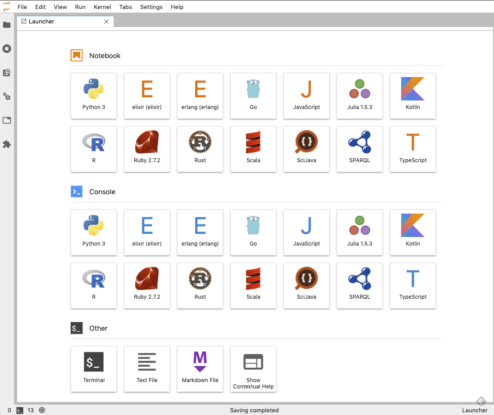

# Jupyter Lab for various languages

Docker images of Jupyter Lab for various languages.



## Support Languages

|Languages|Version|jupyter kernel|
|---|--:|---|
| Python|3.8.6|[IPython](https://ipython.org/)|
| C#(.Net5)| 9.0 | [.NET Interactive](https://github.com/dotnet/interactive)|
| Elixir|1.11.2|[ierl](https://github.com/filmor/ierl)|
| Erlang|OTP 23.2.1|[ierl](https://github.com/filmor/ierl)|
| F#(.Net5)| 5.0 | [.NET Interactive](https://github.com/dotnet/interactive)|
| Go|1.15.6|[Gophernotes](https://github.com/gopherdata/gophernotes)|
| Java |1.8.0_152|[SciJava Jupyter Kernel](https://github.com/hadim/scijava-jupyter-kernel)|
| JavaScript(Node.js)|14.15.3|[tslab](https://github.com/yunabe/tslab)|
| Julia |1.5.3|[IJulia](https://github.com/JuliaLang/IJulia.jl)|
| Kotlin|1.4.30|[jupyter\-kotlin](https://github.com/ligee/kotlin-jupyter)|
| Powershell(.Net5)| 7.0.3 | [.NET Interactive](https://github.com/dotnet/interactive)|
| R |4.0.3|[IRKernel](http://irkernel.github.io/)|
| Ruby| 3.0.0 |[IRuby](https://github.com/SciRuby/iruby)|
| Rust |1.49.0|[EvCxR Jupyter Kernel](https://github.com/google/evcxr/tree/master/evcxr_jupyter)|
| Scala |2.13.3|[almond](https://github.com/almond-sh/almond)|
| Sparql||[SPARQL kernel](https://github.com/paulovn/sparql-kernel)|
| Typescript| 4.1.3 | [tslab](https://github.com/yunabe/tslab)|

* Enabled [Plotly](https://plotly.com/python/), Dash and [leaflet](https://ipyleaflet.readthedocs.io/en/latest/) in Python.

## Usage 

```bash
$ mkdir your/jupyter/project/dir
$ cd your/jupyter/project/dir
$ wget https://raw.githubusercontent.com/HeRoMo/jupyter-langs/master/docker-compose.yml
$ docker-compose up
```

After starting container, you can access http://localhost:8888/ to open jupyter lab.

## License

[MIT](License.txt)
