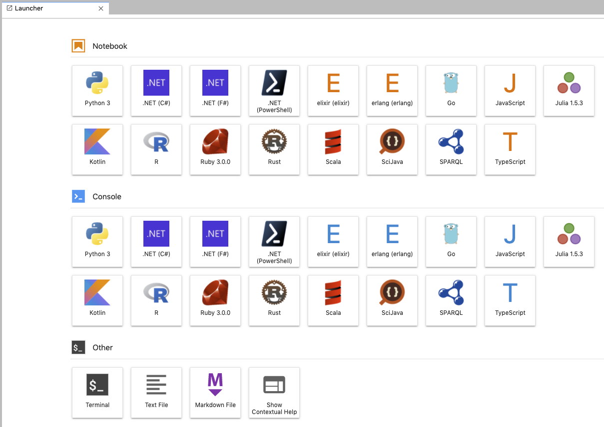

# Jupyter Lab for various languages

Docker images of Jupyter Lab for various languages.



## Support Languages

|Languages|Version|jupyter kernel|
|---|--:|---|
| [Python](https://www.python.org/) |3.10.0|[IPython](https://ipython.org/)|
| [C#](https://docs.microsoft.com/en-us/dotnet/csharp/)(.Net6)| 10.0 | [.NET Interactive](https://github.com/dotnet/interactive)|
| [Elixir](https://elixir-lang.org/) |1.12.3|[ierl](https://github.com/filmor/ierl)|
| [Erlang](https://www.erlang.org/) |OTP 24.0.4|[ierl](https://github.com/filmor/ierl)|
| [F#](https://fsharp.org/)(.Net6) | 6.0.8 | [.NET Interactive](https://github.com/dotnet/interactive)|
| [Go](https://golang.org/) |1.19.1|[Gophernotes](https://github.com/gopherdata/gophernotes)|
| [Java](https://openjdk.java.net/) |18.0.2.1|[Ganymede](https://github.com/allen-ball/ganymede)|
| JavaScript([Node.js](https://nodejs.org/en/))|18.8.0|[tslab](https://github.com/yunabe/tslab)|
| [Julia](https://julialang.org/) |1.8.0|[IJulia](https://github.com/JuliaLang/IJulia.jl)|
| [Kotlin](https://kotlinlang.org/) |1.8.0|[jupyter\-kotlin](https://github.com/ligee/kotlin-jupyter)|
| [Powershell](https://docs.microsoft.com/en-us/powershell/)(.Net6) | 7.2.6 | [.NET Interactive](https://github.com/dotnet/interactive)|
| [R](https://www.r-project.org/) |4.2.1|[IRKernel](http://irkernel.github.io/)|
| [Ruby](https://www.ruby-lang.org/) | 3.1.2 |[IRuby](https://github.com/SciRuby/iruby)|
| [Rust](https://www.rust-lang.org/) |1.64.0|[EvCxR Jupyter Kernel](https://github.com/google/evcxr/tree/master/evcxr_jupyter)|
| [Scala](https://www.scala-lang.org/) |2.13.8|[almond](https://github.com/almond-sh/almond)|
| Sparql||[SPARQL kernel](https://github.com/paulovn/sparql-kernel)|
| [Typescript](https://www.typescriptlang.org/) | 4.8.2 | [tslab](https://github.com/yunabe/tslab)|

* Enabled [Plotly](https://plotly.com/python/), Dash and [leaflet](https://ipyleaflet.readthedocs.io/en/latest/) in Python.
* Enabled [Plotly](https://plotly.com/python/) in R, Julia.

## Usage

```bash
$ mkdir your/jupyter/project/dir
$ cd your/jupyter/project/dir
$ wget https://raw.githubusercontent.com/HeRoMo/jupyter-langs/master/docker-compose.yml
$ docker-compose up
```

After starting container, you can access http://localhost:8888/ to open jupyter lab.

### Use with Visual Studio Code

You can this image as VSCode dev container.
run the following command and open your/jupyter/project/dir in dev container of VSCode.

```bash
$ mkdir your/jupyter/project/dir
$ cd your/jupyter/project/dir
$ curl https://raw.githubusercontent.com/HeRoMo/jupyter-langs/master/docker-compose.yml -O
$ mkdir -p .devcontainer
$ curl https://raw.githubusercontent.com/HeRoMo/jupyter-langs/master/.devcontainer/devcontainer.json -o .devcontainer/devcontainer.json
```

## License

[MIT](License.txt)
